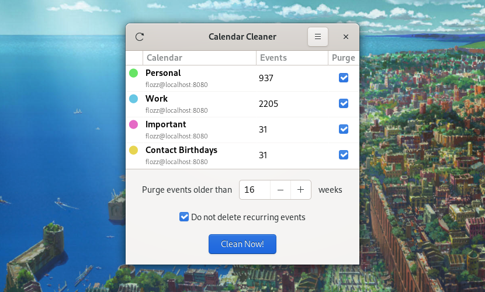

CalCleaner
==========

|Github| |Discord| |Github Actions| |Black| |License|

    A simple graphical tool to purge old events from CalDAV calendars

Requirements
------------

Python:

* `PyGObject <https://pygobject.readthedocs.io/en/latest/>`_
* `caldav <https://github.com/python-caldav/caldav>`_

Install
-------

Flatpak (Linux)
~~~~~~~~~~~~~~~

A Flatpak package is available on Flathub. This is currently the simplest way
to install CalCleaner on all major Linux distributions:

* https://flathub.org/apps/details/org.flozz.calcleaner

Linux (source)
~~~~~~~~~~~~~~

First, you will need to install some dependencies on your system. On Debian and
Ubuntu this can be achieved with the following command::

    sudo apt install git build-essential python3 python3-dev python3-pip libgirepository1.0-dev pkg-config gir1.2-gtk-3.0

Then clone this repository and navigate to it::

    git clone https://github.com/flozz/calcleaner.git
    cd calcleaner

Then install CalCleaner using pip::

    sudo pip3 install .

Finally, you can install desktop file, icons and manual using the following
command::

    sudo ./linuxpkg/copy-data.sh /usr

Linux (PyPI)
~~~~~~~~~~~~

First, you will need to install some dependencies on your system. On Debian and
Ubuntu this can be achieved with the following command::

    sudo apt install git build-essential python3 python3-dev python3-pip libgirepository1.0-dev pkg-config gir1.2-gtk-3.0

Then install CalCleaner using pip::

    sudo pip3 install calcleaner

**NOTE:** Installing from PyPI will not install ``.desktop`` file and man page.
You will not be able to run the software from your graphical app menu (GNOME
Shell,...).

Contributing / Hacking
----------------------

Questions
~~~~~~~~~

If you have any question, you can:

* `open an issue <https://github.com/flozz/calcleaner/issues>`_ on Github,
* or `ask on Discord <https://discord.gg/P77sWhuSs4>`_ (I am not always
  available for chatting but I try to answer to everyone).

Bugs
~~~~

If you found a bug, please `open an issue
<https://github.com/flozz/calcleaner/issues>`_ on Github with as much
information as possible:

* What is your operating system / Linux distribution (and its version),
* How you installed the software,
* All the logs and message outputted by the software,
* ...

Pull Requests
~~~~~~~~~~~~~

Please consider `filing a bug <https://github.com/flozz/calcleaner/issues>`_
before starting to work on a new feature. This will allow us to discuss the
best way to do it. This is of course not necessary if you just want to fix some
typo or small errors in the code.

Please note that your code must pass tests and follow the coding style defined
by the `pep8 <https://pep8.org/>`_. `Flake8
<https://flake8.pycqa.org/en/latest/>`_ and `Black
<https://black.readthedocs.io/en/stable/>`_ are used on this project to enforce
coding style.

Translating Calcleaner
~~~~~~~~~~~~~~~~~~~~~~

If the software is not available in your language, you can help translate it.

To translate Calcleaner, you can submit your translations using a Pull Request
on Github,

Do not forget to add your name as the translation of the ``translator-credits``
key (one name per line, e-mail is optional)::

    msgid "translator-credits"
    msgstr ""
    "John DOE\n"
    "Other TRANSLATOR <foobar@example.org>\n"

Running the project
~~~~~~~~~~~~~~~~~~~

First, install dependencies (preferably in a virtualenv)::

    pip install -e ".[dev]"

Then run::

    python -m calcleaner

Coding Style / Lint
~~~~~~~~~~~~~~~~~~~

This project follows `Black's <https://black.readthedocs.io/en/stable/>`_ coding style.

To check coding style, you will first have to install `nox <https://nox.thea.codes/>`_::

    pip3 install nox

Then you can check for lint error (Flake8 and Black)::

    nox --session lint

You can fix automatically coding style with::

    nox -s black_fix

Tests
~~~~~

Tu run tests, you will first have to install `nox <https://nox.thea.codes/>`_::

    pip3 install nox

Then run the following command::

    nox -s test

Extract, Update or Build Translations
~~~~~~~~~~~~~~~~~~~~~~~~~~~~~~~~~~~~~

You will first have to install `nox <https://nox.thea.codes/>`_::

    pip3 install nox

To extract messages and update locales run::

    nox --session locales_update

To compile locales, run::

    nox --session locales_compile

**NOTE:** you will need to have ``xgettext``, ``msgmerge`` and ``msgfmt``
executable installed on your system to run the above commands. On Debian /
Ubuntu, they can be installed with the following command::

    sudo apt install gettext

Regenerating Icons
~~~~~~~~~~~~~~~~~~

To regenerate icons, Inkscape must be installed. On Debian and Ubuntu you can
install it with the following command::

    sudo apt install inkscape

You will also need `nox <https://nox.thea.codes/>`_ to run the generation
command::

    pip3 install nox

Once everithing installed, you can regenerate icons with the following command::

    nox -s gen_icons

Supporting this project
-----------------------

Wanna support this project?

* `☕️ Buy me a coffee <https://www.buymeacoffee.com/flozz>`__,
* `❤️ sponsor me on Github <https://github.com/sponsors/flozz>`__,
* `💵️ or give me a tip on PayPal <https://www.paypal.me/0xflozz>`__.

Changelog
---------

* **[NEXT]** (changes on ``master`` but not released yet):

  * Nothing yet ;)

* **v1.1.3:**

  * Added Turkish translation (@sabriunal, #8)

* **v1.1.2:**

  * Added Croatian translation (@milotype, #7)
  * Added Python 3.11 support

* **v1.1.1:**

  * Added German translation (Jürgen Benvenuti)

* **v1.1.0:**

  * UI improvements:

    * Double border removed in calendar view
    * Accessibility improved by changing the widgets used to build the "pages"
      of the main window

  * Translations:

    * Dutch (#5, @Vistaus)
    * Brazilian Portuguese (incomplete)

* **v1.0.0:**

  * Allow to disable SSL certificate validation (self-signed certificate, etc.)
  * Improve error message on SSL errors
  * Set the user agent string to "CalCleaner/<VERSION>"
  * Fix calendar of removed account still displayed after closing account
    management dialog
  * Fix a crash when cleaning an empty (malformed) event
  * Italian translation (#1, @albanobattistella)

* **v0.9.1 (beta):**

  * Fix data not included in packages

* **v0.9.0 (beta):**

  * Initial release
  * French translation

.. |Github| image:: https://img.shields.io/github/stars/flozz/calcleaner?label=Github&logo=github
   :target: https://github.com/flozz/calcleaner

.. |Discord| image:: https://img.shields.io/badge/chat-Discord-8c9eff?logo=discord&logoColor=ffffff
   :target: https://discord.gg/P77sWhuSs4

.. |Github Actions| image:: https://github.com/flozz/calcleaner/actions/workflows/python-ci.yml/badge.svg
   :target: https://github.com/flozz/calcleaner/actions

.. |Black| image:: https://img.shields.io/badge/code%20style-black-000000.svg
   :target: https://black.readthedocs.io/en/stable/

.. |License| image:: https://img.shields.io/github/license/flozz/calcleaner
   :target: https://github.com/flozz/calcleaner/blob/master/COPYING
